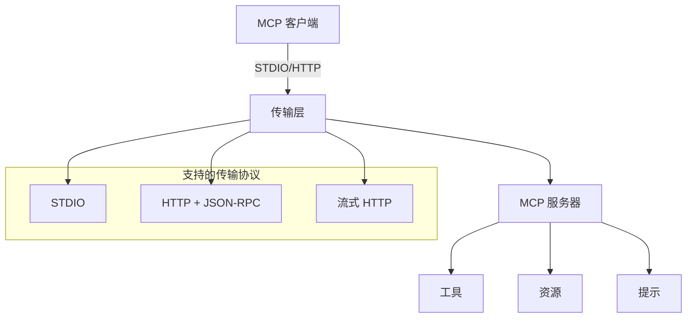

# PHP MCP 项目概览

## 🏗️ 架构



### 核心组件

1. **服务端** (`src/Server/`) - MCP 服务器实现
2. **客户端** (`src/Client/`) - MCP 客户端实现  
3. **传输** (`src/Shared/Transport/`) - 通信协议
4. **类型** (`src/Types/`) - 协议数据结构
5. **内核** (`src/Shared/Kernel/`) - 核心应用框架

## 🌟 功能特性

### 传输协议

| 协议 | 状态 | 描述 |
|------|------|------|
| STDIO | ✅ | 标准输入输出通信 |
| HTTP | ✅ | HTTP 上的 JSON-RPC |
| 流式 HTTP | 🚧 | HTTP POST + 服务器发送事件 |

### MCP 功能

- ✅ **工具** - 带动态参数的函数调用
- ✅ **资源** - 数据访问和内容管理  
- ✅ **提示** - 模板和提示管理
- ✅ **错误处理** - 全面的错误管理
- ✅ **日志记录** - 使用 PSR-3 的结构化日志
- ✅ **事件** - 使用 PSR-14 的事件驱动架构

## 🔧 高级用法

### 自定义工具注册

```php
// 注册多个工具
$server
    ->registerTool($calculatorTool, $calculatorHandler)
    ->registerTool($fileReadTool, $fileReadHandler)
    ->registerResource($configResource, $configHandler);
```

### HTTP 服务器部署

```php
// 带自定义端点的 HTTP 服务器
$response = $server->http($request); // PSR-7 请求/响应
```

## 📊 当前开发状态

### ✅ 已完成
- MCP 协议 2025-03-26 实现
- STDIO 传输（服务端 + 客户端）
- HTTP 传输（基础 JSON-RPC）
- 核心 MCP 功能（工具、资源、提示）
- 综合文档
- 工作示例

### 🚧 开发中  
- 流式 HTTP 传输（HTTP + SSE）
- 授权框架（OAuth 2.1）
- JSON-RPC 批处理支持
- 性能优化

### 📋 计划中
- 工具注解和元数据
- 增强的监控和指标
- 特定框架集成
- Docker 部署模板

## 🛠️ 系统要求

- **PHP**: 7.4+（推荐 8.0+）
- **扩展**: `json`, `mbstring`, `openssl`, `pcntl`, `curl`
- **Composer**: 用于依赖管理

### 依赖项
- **Guzzle HTTP**: 用于 HTTP 传输（自动安装）
- **PSR Log**: 用于日志记录（自动安装）
- **PSR Event Dispatcher**: 用于事件（自动安装）
- **PSR Container**: 用于依赖注入（自动安装）

## 🌐 框架集成

兼容任何支持 PSR 标准的 PHP 框架：

### Laravel
```php
// 服务提供者示例
class McpServiceProvider extends ServiceProvider
{
    public function register()
    {
        $this->app->singleton(McpServer::class, function ($app) {
            return new McpServer('my-server', '1.0.0', $app);
        });
    }
}
```

### Symfony
```php
// Bundle 集成
class McpBundle extends Bundle
{
    public function build(ContainerBuilder $container)
    {
        $container->register(McpServer::class)
            ->setArguments(['my-server', '1.0.0', '@service_container']);
    }
}
```

### Hyperf
```php
// 兼容协程环境
$server = make(McpServer::class, ['my-server', '1.0.0']);
```

### 其他框架
- **ThinkPHP** - 与 TP 的容器系统配合
- **CodeIgniter** - 可作为库使用
- **自定义框架** - 只需实现 PSR ContainerInterface

## 🎯 使用场景

### 1. API 集成服务器
创建将外部 API 作为 MCP 工具公开的服务器：

```php
$server->registerTool(createWeatherTool(), function($args) {
    return callWeatherAPI($args['location']);
});
```

### 2. 数据库查询接口
通过 MCP 提供安全的数据库访问：

```php
$server->registerTool(createDatabaseTool(), function($args) {
    return executeQuery($args['query'], $args['params']);
});
```

### 3. 文件系统操作
通过 MCP 协议进行安全的文件操作：

```php
$server->registerTool(createFileManagerTool(), function($args) {
    return manageFiles($args['operation'], $args['path']);
});
```

### 4. AI 模型集成
通过 MCP 连接 AI 模型：

```php
$server->registerTool(createAITool(), function($args) {
    return callAIModel($args['prompt'], $args['model']);
});
```

## 🔒 安全考虑

### 身份验证
- 实现兼容 PSR 的认证器
- 支持 OAuth 2.1（计划中）
- 自定义认证处理器

### 速率限制
- 内置速率限制支持
- 可配置的每客户端限制
- 基于 Redis 的分布式限制

### 输入验证
- 自动 JSON-RPC 验证
- 自定义参数验证
- 基于模式的工具参数验证

## 📈 性能

### 基准测试
- STDIO: ~1000 请求/秒
- HTTP: ~500 请求/秒
- 内存使用: 典型工作负载 <50MB

### 优化建议
1. 为数据库使用连接池
2. 为昂贵操作实现缓存
3. 配置适当的超时
4. 使用 PSR-6 缓存进行资源缓存

## 🧪 测试

### 单元测试
```bash
composer test:unit
```

### 集成测试
```bash
composer test:integration
```

### 性能测试
```bash
php examples/performance-test.php
```

## 🚀 部署

### 生产检查清单
- [ ] 配置适当的日志记录
- [ ] 设置监控
- [ ] 实施身份验证
- [ ] 配置速率限制
- [ ] 设置健康检查
- [ ] 配置错误处理
- [ ] 针对您的用例进行优化

### Docker 部署
```dockerfile
FROM php:8.1-fpm-alpine
COPY . /app
WORKDIR /app
RUN composer install --no-dev --optimize-autoloader
CMD ["php", "server.php"]
```

### Kubernetes 部署
```yaml
apiVersion: apps/v1
kind: Deployment
metadata:
  name: mcp-server
spec:
  replicas: 3
  selector:
    matchLabels:
      app: mcp-server
  template:
    spec:
      containers:
      - name: mcp-server
        image: your-registry/mcp-server:latest
        ports:
        - containerPort: 8080
```

## 🤝 贡献

我们欢迎贡献！以下是您可以帮助的方式：

### 开发环境设置

```bash
git clone https://github.com/dtyq/php-mcp.git
cd php-mcp
composer install
./vendor/bin/phpunit
```

### 运行测试

```bash
# 运行所有测试
composer test

# 仅运行单元测试
composer test:unit

# 运行静态分析
composer analyse

# 修复代码风格
composer cs-fix
```

### 代码标准
- 遵循 PSR-12 编码标准
- 编写全面的测试
- 记录您的更改
- 遵循语义版本控制

### 贡献领域
- 🐛 错误修复
- ✨ 新功能
- 📚 文档改进
- 🧪 额外测试
- 🚀 性能优化
- 🔧 框架集成

## 📚 额外资源

- [MCP 规范](https://modelcontextprotocol.io/)
- [PHP-FIG PSR 标准](https://www.php-fig.org/psr/)
- [Guzzle HTTP 文档](https://docs.guzzlephp.org/)
- [PSR-7 HTTP 消息接口](https://www.php-fig.org/psr/psr-7/)

## ❓ 常见问题

### Q: 我可以在旧版 PHP 中使用吗？
A: 需要 PHP 7.4+。对于旧版本，请考虑升级或使用兼容层。

### Q: 这是生产就绪的吗？
A: 是的，但请在您的环境中彻底测试。监控性能并实施适当的错误处理。

### Q: 如何贡献？
A: 查看我们的问题页面，fork 仓库，进行更改，并提交 pull request。

### Q: 传输协议之间有什么区别？
A: STDIO 用于进程通信，HTTP 用于 Web 集成，流式 HTTP 用于实时应用程序。

### Q: 我可以使用自定义容器吗？
A: 是的，任何兼容 PSR-11 的容器都可以工作。示例显示了简单的实现。 