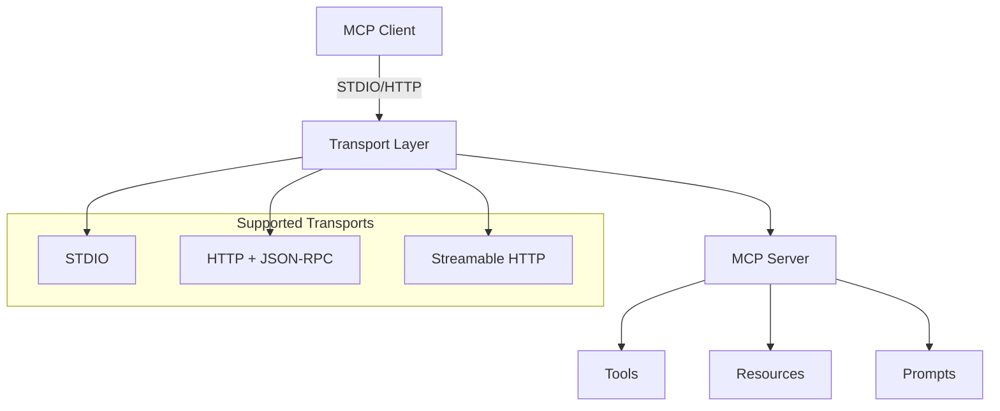

# PHP MCP Overview

## 🏗️ Architecture



### Core Components

1. **Server** (`src/Server/`) - MCP server implementation
2. **Client** (`src/Client/`) - MCP client implementation  
3. **Transport** (`src/Shared/Transport/`) - Communication protocols
4. **Types** (`src/Types/`) - Protocol data structures
5. **Kernel** (`src/Shared/Kernel/`) - Core application framework

## 🌟 Features

### Transport Protocols

| Protocol | Status | Description |
|----------|--------|-------------|
| STDIO | ✅ | Standard Input/Output communication |
| HTTP | ✅ | JSON-RPC over HTTP |
| Streamable HTTP | 🚧 | HTTP POST + Server-Sent Events |

### MCP Capabilities

- ✅ **Tools** - Function calling with dynamic arguments
- ✅ **Resources** - Data access and content management  
- ✅ **Prompts** - Template and prompt management
- ✅ **Error Handling** - Comprehensive error management
- ✅ **Logging** - Structured logging with PSR-3
- ✅ **Events** - Event-driven architecture with PSR-14

## 🔧 Advanced Usage

### Custom Tool Registration

```php
// Register multiple tools
$server
    ->registerTool($calculatorTool, $calculatorHandler)
    ->registerTool($fileReadTool, $fileReadHandler)
    ->registerResource($configResource, $configHandler);
```

### HTTP Server Deployment

```php
// HTTP server with custom endpoint
$response = $server->http($request); // PSR-7 Request/Response
```

## 📊 Current Development Status

### ✅ Completed
- MCP Protocol 2025-03-26 implementation
- STDIO transport (server + client)
- HTTP transport (basic JSON-RPC)
- Core MCP features (tools, resources, prompts)
- Comprehensive documentation
- Working examples

### 🚧 In Progress  
- Streamable HTTP transport (HTTP + SSE)
- Authorization framework (OAuth 2.1)
- JSON-RPC batching support
- Performance optimizations

### 📋 Planned
- Tool annotations and metadata
- Enhanced monitoring and metrics
- Framework-specific integrations
- Docker deployment templates

## 🛠️ Requirements

- **PHP**: 7.4+ (8.0+ recommended)
- **Extensions**: `json`, `mbstring`, `openssl`, `pcntl`, `curl`
- **Composer**: For dependency management

### Dependencies
- **Guzzle HTTP**: For HTTP transport (auto-installed)
- **PSR Log**: For logging (auto-installed)
- **PSR Event Dispatcher**: For events (auto-installed)
- **PSR Container**: For dependency injection (auto-installed)

## 🌐 Framework Integration

Compatible with any PHP framework that supports PSR standards:

### Laravel
```php
// Service Provider example
class McpServiceProvider extends ServiceProvider
{
    public function register()
    {
        $this->app->singleton(McpServer::class, function ($app) {
            return new McpServer('my-server', '1.0.0', $app);
        });
    }
}
```

### Symfony
```php
// Bundle integration
class McpBundle extends Bundle
{
    public function build(ContainerBuilder $container)
    {
        $container->register(McpServer::class)
            ->setArguments(['my-server', '1.0.0', '@service_container']);
    }
}
```

### Hyperf
```php
// Compatible with coroutine environments
$server = make(McpServer::class, ['my-server', '1.0.0']);
```

### Other Frameworks
- **ThinkPHP** - Works with TP's container system
- **CodeIgniter** - Can be used as a library
- **Custom Frameworks** - Just implement PSR ContainerInterface

## 🎯 Use Cases

### 1. API Integration Server
Create servers that expose external APIs as MCP tools:

```php
$server->registerTool(createWeatherTool(), function($args) {
    return callWeatherAPI($args['location']);
});
```

### 2. Database Query Interface
Provide safe database access through MCP:

```php
$server->registerTool(createDatabaseTool(), function($args) {
    return executeQuery($args['query'], $args['params']);
});
```

### 3. File System Operations
Secure file operations via MCP protocol:

```php
$server->registerTool(createFileManagerTool(), function($args) {
    return manageFiles($args['operation'], $args['path']);
});
```

### 4. AI Model Integration
Connect AI models through MCP:

```php
$server->registerTool(createAITool(), function($args) {
    return callAIModel($args['prompt'], $args['model']);
});
```

## 🔒 Security Considerations

### Authentication
- Implement PSR-compatible authenticators
- Support for OAuth 2.1 (planned)
- Custom authentication handlers

### Rate Limiting
- Built-in rate limiting support
- Configurable limits per client
- Redis-based distributed limiting

### Input Validation
- Automatic JSON-RPC validation
- Custom parameter validation
- Schema-based tool argument validation

## 📈 Performance

### Benchmarks
- STDIO: ~1000 requests/second
- HTTP: ~500 requests/second
- Memory usage: <50MB for typical workloads

### Optimization Tips
1. Use connection pooling for databases
2. Implement caching for expensive operations
3. Configure appropriate timeouts
4. Use PSR-6 cache for resource caching

## 🧪 Testing

### Unit Tests
```bash
composer test:unit
```

### Integration Tests
```bash
composer test:integration
```

### Performance Tests
```bash
php examples/performance-test.php
```

## 🚀 Deployment

### Production Checklist
- [ ] Configure proper logging
- [ ] Set up monitoring
- [ ] Implement authentication
- [ ] Configure rate limiting
- [ ] Set up health checks
- [ ] Configure error handling
- [ ] Optimize for your use case

### Docker Deployment
```dockerfile
FROM php:8.1-fpm-alpine
COPY . /app
WORKDIR /app
RUN composer install --no-dev --optimize-autoloader
CMD ["php", "server.php"]
```

### Kubernetes Deployment
```yaml
apiVersion: apps/v1
kind: Deployment
metadata:
  name: mcp-server
spec:
  replicas: 3
  selector:
    matchLabels:
      app: mcp-server
  template:
    spec:
      containers:
      - name: mcp-server
        image: your-registry/mcp-server:latest
        ports:
        - containerPort: 8080
```

## 🤝 Contributing

We welcome contributions! Here's how you can help:

### Development Setup

```bash
git clone https://github.com/dtyq/php-mcp.git
cd php-mcp
composer install
./vendor/bin/phpunit
```

### Running Tests

```bash
# Run all tests
composer test

# Run unit tests only
composer test:unit

# Run static analysis
composer analyse

# Fix code style
composer cs-fix
```

### Code Standards
- Follow PSR-12 coding standard
- Write comprehensive tests
- Document your changes
- Follow semantic versioning

### Areas for Contribution
- 🐛 Bug fixes
- ✨ New features
- 📚 Documentation improvements
- 🧪 Additional tests
- 🚀 Performance optimizations
- 🔧 Framework integrations

## 📚 Additional Resources

- [MCP Specification](https://modelcontextprotocol.io/)
- [PHP-FIG PSR Standards](https://www.php-fig.org/psr/)
- [Guzzle HTTP Documentation](https://docs.guzzlephp.org/)
- [PSR-7 HTTP Message Interface](https://www.php-fig.org/psr/psr-7/)

## ❓ FAQ

### Q: Can I use this with legacy PHP versions?
A: PHP 7.4+ is required. For older versions, consider upgrading or using a compatibility layer.

### Q: Is this production ready?
A: Yes, but thoroughly test in your environment. Monitor performance and implement proper error handling.

### Q: How do I contribute?
A: Check our issues page, fork the repository, make your changes, and submit a pull request.

### Q: What's the difference between transports?
A: STDIO is for process communication, HTTP for web integration, and Streamable HTTP for real-time applications.

### Q: Can I use custom containers?
A: Yes, any PSR-11 compatible container works. The examples show simple implementations. 